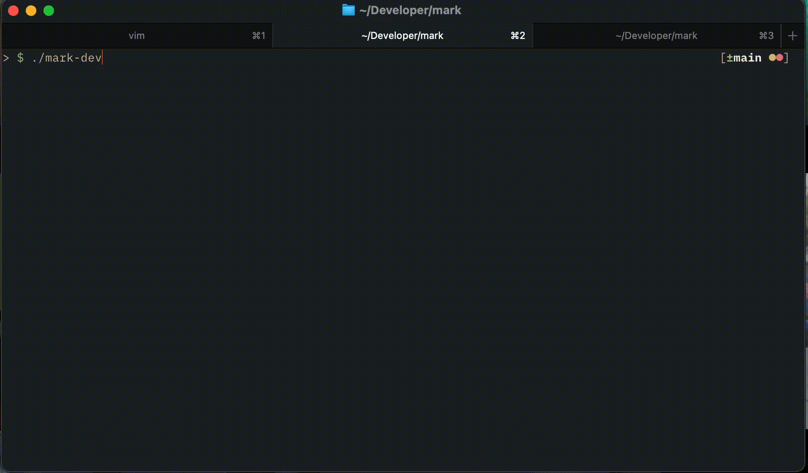
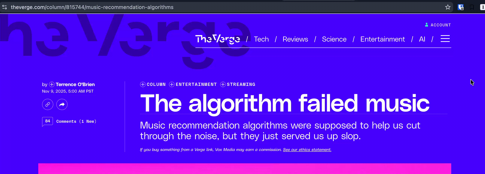
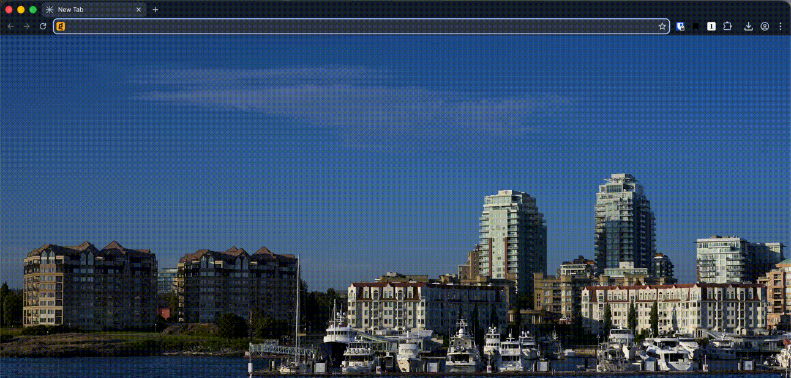

# mark



Mark is a simple bookmark manager that allows you to save and recall bookmarks.
It also allows you to sync those changes across all your devices using a
file sync service. This is sort-of explained the following blog post:
https://lukaswerner.com/post/2024-08-13@Sqlite-Local-First

### Installation

1. Download GitHub repo
`git clone https://github.com/lukasmwerner/mark.git`
2. Install program
`go install --tags fts5 .`
3. Enjoy!

### Sync

By default `mark` stores its data in `~/.config/mark/data.db` whereas the
important sync data is stored in `~/.config/mark/changes/`. If you want to
ensure that sync occurs, configure whatever your sync engine is (Dropbox,
Google Drive, Syncthing etc) to synchronize only the changes folder.

### Usage
```
Available Commands:
  add         Add a bookmark
  completion  Generate the autocompletion script for the specified shell
  delete      deletes bookmarks based on given search query
  dump        dumps the database to a sqlite3 file
  edit        Edit a bookmark
  help        Help about any command
  import      Lets you import bookmarks from an existing csv
  keys        List all allowed api keys for the local http server
  open        Opens the matching search link in the user's browser
  search      [EXPERIMENTAL] google search like tui intended for hosting via gotty or ttyd
  server      Local HTTP server for managing bookmarks (used for chrome extension)
  show        Shows the entry of a bookmark
  sql         Lets you run sql queries on your database
```


## Chrome Extension



To load the chrome extension, go into the `chrome-extension` folder and install
all dependencies, `pnpm i`. Then build the extension locally, `pnpm run build`.
You can now load the unpacked extension from the newly created `dist` folder.

To configure the extension right click the bookmark icon and select 'Options'.
There you will be able to setup your mark API key (you can generate one using
`mark keys new`, or list existing keys using `mark keys`), what your Ollama
host is, and configure prompts.

There is a [custom fine-tuned tagging model based on llama3.2:1b available on
Ollama](https://ollama.com/lukasmwerner/mark-tagger). The goal is that as my
bookmark collection grows I will be able to further fine-tune that model to get
better tagging capability.

## Raycast Extension



To load the Raycast extension, go into the `raycast-extension` folder and install
all dependencies, `pnpm i`. Then build and install locally via `pnpm run dev`.

To load the API key go to the Raycast settings page and under the 'Open Bookmark'
extension paste the API key in the options pane.

## Related Blogposts
- [Syncing SQLite in a Local-First Way](https://lukaswerner.com/post/2024-08-13@Sqlite-Local-First)
- [Dealing With Small Model Context Windows](https://lukaswerner.com/post/2025-11-12@mark-context-windows)

